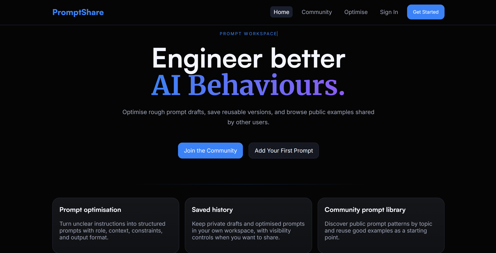
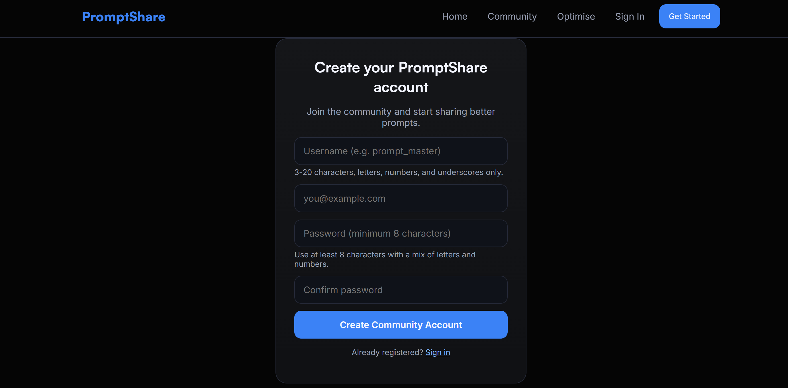
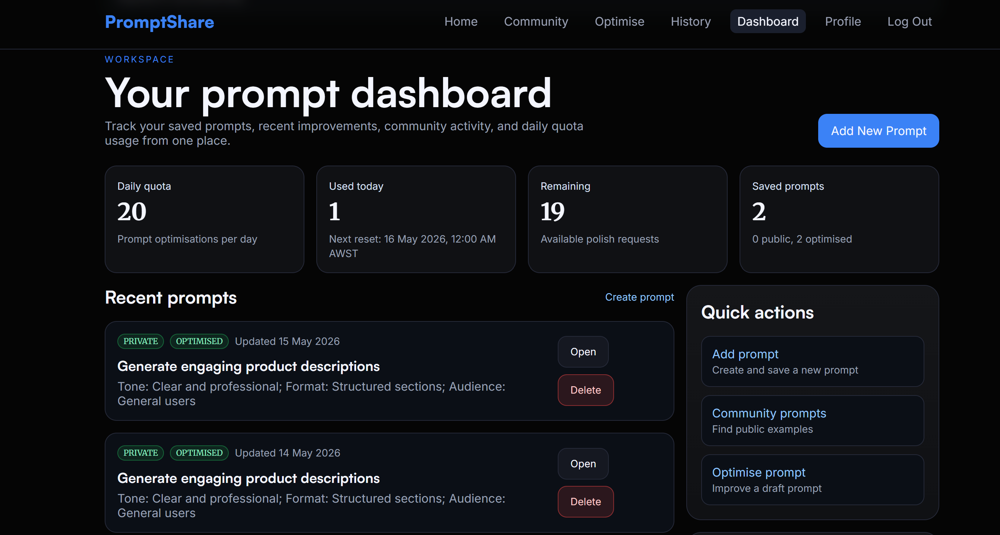
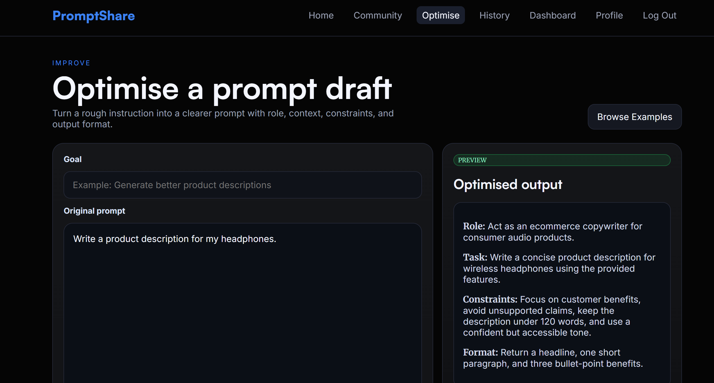
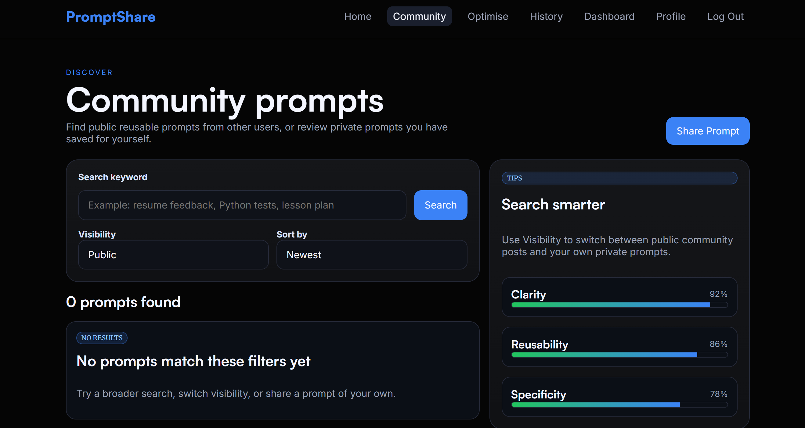

# CITS3403_5505_Project

PromptShare is a Flask web application for polishing AI prompts, saving prompt history, managing daily optimisation quota, and browsing intentionally shared community prompt examples.

## Features

- Sign up, log in, log out, and manage profile details.
- Change account password with current-password verification.
- Optimise prompts with a local fallback optimiser and optional Groq API support.
- Save public or private prompts to a SQLite database.
- Browse public community prompts and review your own private prompts.
- View personal history with search, type filtering, visibility controls, sorting, and "Optimise Again".
- Track daily optimisation quota on the dashboard. The default limit is 20 per user per day and resets at 12:00 am in the configured timezone, defaulting to Australia/Perth.

## Screenshots

### Homepage


### Sign Up


### Dashboard


### Optimise a Prompt


### Community Page


## Project Structure

```text
project-root/
|-- app.py
|-- config.py
|-- controllers.py
|-- extensions.py
|-- forms.py
|-- models.py
|-- routes.py
|-- requirements.txt
|-- migrations/
|-- tests/
|   |-- selenium/
|   `-- unit/
|-- templates/
|   |-- base.html
|   |-- community.html
|   |-- dashboard.html
|   |-- history.html
|   |-- index.html
|   |-- login.html
|   |-- optimise.html
|   |-- profile.html
|   |-- prompt_form.html
|   `-- signup.html
`-- static/
    |-- css/
    |-- images/
    `-- js/
```

## Team Members

| UWA ID | Name | GitHub username |
| --- | --- | --- |
| 24547664 | Chenxu You | ChenxuYou |
| 25057384 | Anto Melvin Mathew | ANTOMELV |
| 24433446 | Sunjol Singh Paul | sunjol |
| 24975803 | Shravan S Kumar Suresh Kumar | ShravansKumar |

## Launch

```bash
python -m venv .venv
.venv\Scripts\activate
pip install -r requirements.txt
flask --app run db upgrade
flask --app run run
```

Then open `http://127.0.0.1:5000`.

You can also run the app directly with `python app.py` for quick local testing.

## Configuration

Copy `.env.example` to `.env` for local overrides. Keep `.env`, API keys, and local database files out of Git.

```text
SECRET_KEY=replace-with-a-real-secret-key
APP_TIMEZONE=Australia/Perth
DAILY_PROMPT_QUOTA=20
GROQ_API_KEY=
GROQ_MODEL=llama-3.1-8b-instant
```

## Optional Groq Model

The optimise page uses the local fallback by default. To enable the `Use Groq model` option, add these values to `.env`:

```text
GROQ_API_KEY=your_key_here
GROQ_MODEL=llama-3.1-8b-instant
```

If Groq is unavailable or blocks the request, the app falls back to the local optimiser so the project remains markable.

## Running Tests

Run the root app unit tests:

```bash
pytest tests/unit tests/test_auth.py -v
```

Run Selenium tests:

```bash
pytest tests/selenium -v
```

Selenium tests require Google Chrome. The `webdriver-manager` package can download the matching ChromeDriver. If ChromeDriver is already installed, set `CHROMEDRIVER_PATH` to its executable path to avoid a network download.